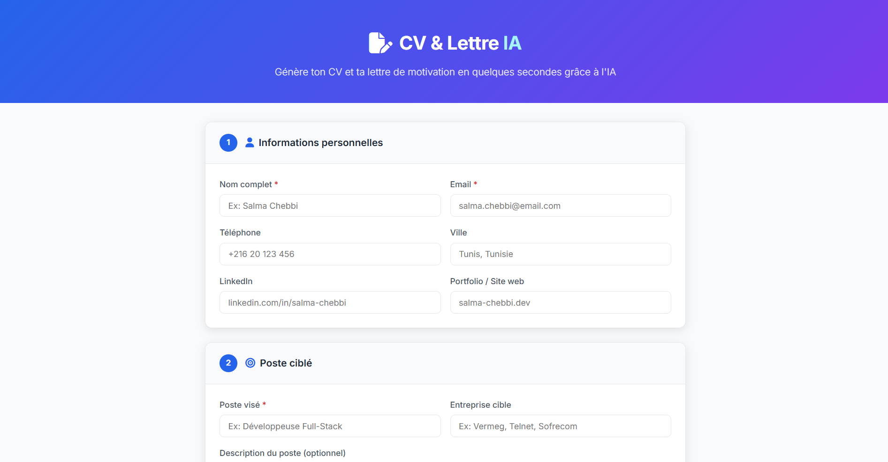
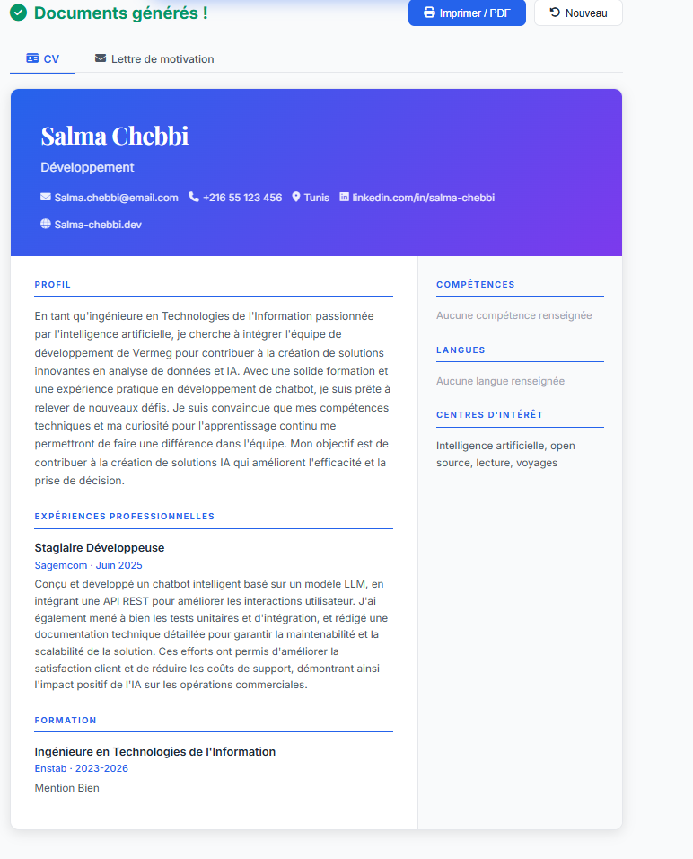
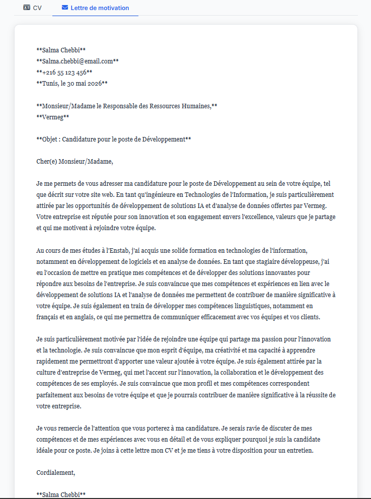

# Générateur automatique de CV et lettres de motivation 🤖

Application web qui génère automatiquement un CV professionnel et une lettre de motivation personnalisée grâce à un grand modèle de langage (LLM).

---

## Aperçu

L'utilisateur remplit un formulaire avec ses informations personnelles, sa formation, ses expériences et ses compétences, puis clique sur **Générer**. En quelques secondes, l'IA produit :

- Un **CV formaté** avec un résumé professionnel et des descriptions d'expérience optimisées
- Une **lettre de motivation personnalisée**, adaptée au poste et à l'entreprise ciblés

---

## Captures d'écran

### Formulaire de saisie


### CV généré


### Lettre de motivation générée


> *Les captures d'écran sont à ajouter dans le dossier `screenshots/` après lancement de l'application.*

---

## Technologies utilisées

| Couche | Technologie |
|--------|-------------|
| Backend | Python · Flask 3.0 |
| **Modèle génératif (LLM)** | **LLaMA 3.3 70B via Groq API** |
| Frontend | HTML5 · CSS3 · JavaScript (vanilla) |
| Polices & icônes | Google Fonts (Inter, Playfair Display) · Font Awesome 6 |
| Dépendances Python | `groq`, `python-dotenv` |

---

## Fonctionnalités

- Formulaire multi-sections avec champs dynamiques (formation, expériences)
- Saisie des compétences et langues sous forme de tags
- Génération IA via **Groq API** (LLaMA 3.3 70B Versatile)
  - Résumé professionnel percutant
  - Amélioration automatique des descriptions d'expérience
  - Lettre de motivation complète et personnalisée
- Prévisualisation du CV avec mise en page professionnelle
- Impression / export PDF directement depuis le navigateur
- Interface responsive (mobile-friendly)

---

## Installation et lancement

### Prérequis

- Python 3.10+
- Une clé API Groq (gratuite sur [console.groq.com](https://console.groq.com))

### Étapes

```bash
# 1. Cloner le dépôt
git clone https://github.com/<votre-username>/<nom-du-repo>.git
cd <nom-du-repo>

# 2. Créer et activer un environnement virtuel
python -m venv venv
# Windows :
venv\Scripts\activate
# macOS/Linux :
source venv/bin/activate

# 3. Installer les dépendances
pip install -r requirements.txt

# 4. Configurer la clé API
# Ouvrir le fichier .env et remplacer la valeur :
# GROQ_API_KEY=votre_clé_groq_ici

# 5. Lancer l'application
python app.py
```

Ouvrir le navigateur à l'adresse : **http://localhost:5000**

---

## Structure du projet

```
.
├── app.py                  # Backend Flask + intégration Groq LLM
├── requirements.txt        # Dépendances Python
├── .env                    # Clé API (non commitée)
├── .gitignore
├── README.md           
├── templates/
│   └── index.html          # Interface utilisateur (HTML)
└── static/
    ├── css/
    │   └── style.css       # Styles CSS
    └── js/
        └── script.js       # Logique frontend (JS)
```

---

## Comment utiliser

1. **Informations personnelles** — Renseigner nom, email, téléphone, ville, LinkedIn
2. **Poste ciblé** — Indiquer le poste visé, l'entreprise et coller l'offre d'emploi (optionnel mais recommandé)
3. **Formation** — Ajouter une ou plusieurs formations avec l'établissement et les années
4. **Expériences** — Ajouter les expériences professionnelles (stage, CDI, alternance…)
5. **Compétences & Langues** — Saisir les compétences techniques et les langues (appuyer sur Entrée pour valider chaque tag)
6. Cliquer sur **Générer mon CV & ma lettre de motivation**
7. Consulter le CV dans l'onglet **CV** et la lettre dans **Lettre de motivation**
8. Cliquer sur **Imprimer / PDF** pour exporter le CV

---

## Modèle génératif utilisé

Ce projet utilise **LLaMA 3.3 70B Versatile**, un grand modèle de langage (LLM) open-source de Meta, accessible via l'API **Groq** qui offre une inférence ultra-rapide.

Le LLM est utilisé pour :
- Analyser le profil du candidat et le poste ciblé
- Générer un résumé professionnel adapté
- Améliorer les descriptions d'expérience avec des verbes d'action
- Rédiger une lettre de motivation complète et personnalisée


